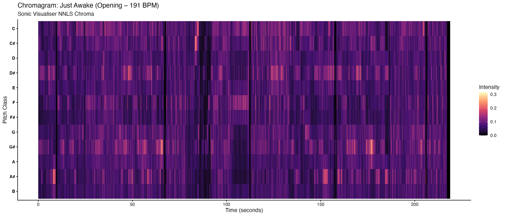
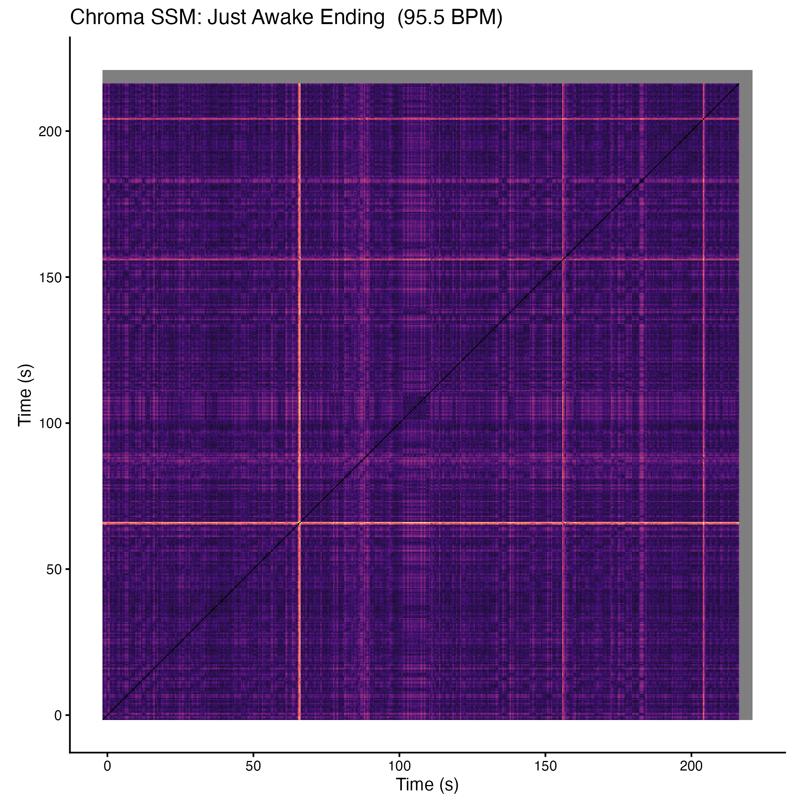

# Chromagrams & Self-Similarity Matrices
**Corpus: Anime Openings & Endings**

---

## Chromagram: Just Awake – Opening (191 BPM) vs Ending (95.5 BPM)

"Just Awake" by Fear, and Loathing in Las Vegas appears in both playlists, as an opening (191 BPM) and as an ending (95.5 BPM). Both chromagrams were extracted using Sonic Visualiser's NNLS Chroma plugin. They show the same dominant pitch classes (C, G#, D#) in both versions. When you listen to both tracks, you hear the same chord progression and melody, just at half the speed in the ending version. The chroma features confirm this: the harmonic structure is identical, only the time axis differs.

---

## Self-Similarity Matrices: Just Awake – Chroma-based

The chroma-based Self-Similarity Matrix shows how harmonically similar each moment of the song is to every other moment. The repeating diagonal blocks correspond to the verses and choruses that you can clearly hear returning throughout both versions. In the opening (191 BPM) the blocks are compressed; in the ending (95.5 BPM) the same blocks are stretched out, same structure, different pace. The structure is very clear in both matrices, which reflects how the song has a strong, repetitive harmonic pattern that is easy to follow while listening.
